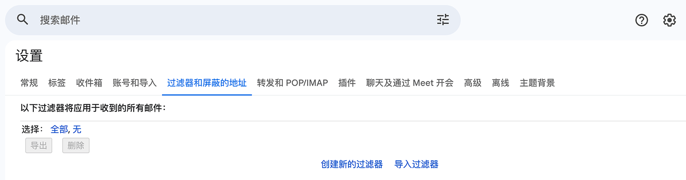
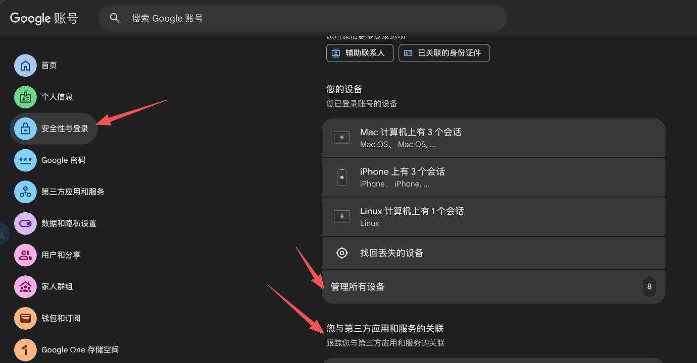

# Google 账号购买、养号与学生资格获取完整指南

[English](README_EN.md)

---

> 本文原创首发于 LINUX DO，作者 @sauterne 。转载请注明出处和个人 github repo 链接：https://github.com/dongshuyan/GoogleAccount。

为了组反重力的号池，前前后后自己注册加购买得有 100 个号左右了。既在站里看到需要大佬的踩坑也自己踩过各种坑，现在来总结一个最全的买号流程分享给各位佬友。

### 0. 购买账号

为了避嫌，我不会提任何购买渠道请各位佬友自行搜索，也不要私信问我。因为任何渠道我都踩过坑。

购买之后每个账号的格式应该类似于：

```
XXX@gmail.com|密码|辅助邮箱|2FA|国家（可有可无）
```

> **重要提示**：后续所有步骤，建议使用纯净的美国代理并在指纹浏览器的环境下完成！

### 1. 设置邮件转发给自己的某个任意邮箱



- 查看 **Filters and Blocked Addresses**（过滤器和屏蔽的地址），确保是空的
- 在 **Forwarding and POP/IMAP**（转发和 POP/IMAP）中配置好邮件转发

这一步非常重要，后面有任何问题，这是一个兜底的找回方案。

### 2. 关闭所有支付资料状态

- 访问：<https://payments.google.com/gp/w/u/1/home/settings>
- 删除所有原有的支付方式和支付信息，关闭所有支付资料状态
- 注意：这个不会影响账号现有的学生会员状态，其他不清楚

### 3. 踢出所有其他客户端及第三方应用和服务的关联

踢出所有其他客户端并打开 **Enhanced Safe Browsing for your account**。



### 4. 修改 2FA、密码

相同页面，先修改 2FA，再修改密码。

### 5. 创建 Passkey 与 Backup Code

相同页面，在两步验证里面先添加 passkey，再生成并保存 backup code。

### 6. 创建新的 Console Project

- 访问：<https://console.cloud.google.com/>
- 创建新的 project，有了 project 才能用 Gemini CLI

### 7. 修改国籍（两处都要修改）

#### 7.1 第一处

- 访问：<https://policies.google.com/u/1/country-association-form?pli=1&pageId=none>
- 首选美国

#### 7.2 第二处

- 访问：<https://play.google.com/store/paymentmethods>
- 查看右下角的国际是不是美区，一般来说只要是美区的代理访问的大概率已经是美区了
- 实在不行参考：<https://linux.do/t/topic/1287642>

### 8. 年龄验证

- 访问：<https://myaccount.google.com/u/1/age-verification>
- 可以自己验证，也可以使用此网址自动通过（网站我试过，不过不保证可用性和安全性，自行选择）：<https://age.tokawa-sakiko.xyz/>

### 9. AI Studio 创建账号

- 访问：<https://aistudio.google.com/u/1/prompts/new_chat?pli=1>

### 10. 访问 Gemini

- 访问：<https://gemini.google.com/u/1/app?pageId=none>
- 如果不行就先创建 gem：<https://gemini.google.com/u/1/gems/create?hl=en-US&pli=1&pageId=none>
- 如果还不行就只能把这个账号拉入一个 Pro 家庭组来开 Gemini 权限了

如果需要通过创建 gem 或者拉入一个 Pro 家庭组才有 Gemini 权限，那么这个账号基本就没有学生资格了；如果一开始就可以使用 Gemini，那么一般只要你的代理足够纯净就有学生资格。

### 11. 查看学生资格

- 访问：<https://one.google.com/u/1/ai-student?g1_landing_page=75&otzr=1&pageId=none>
